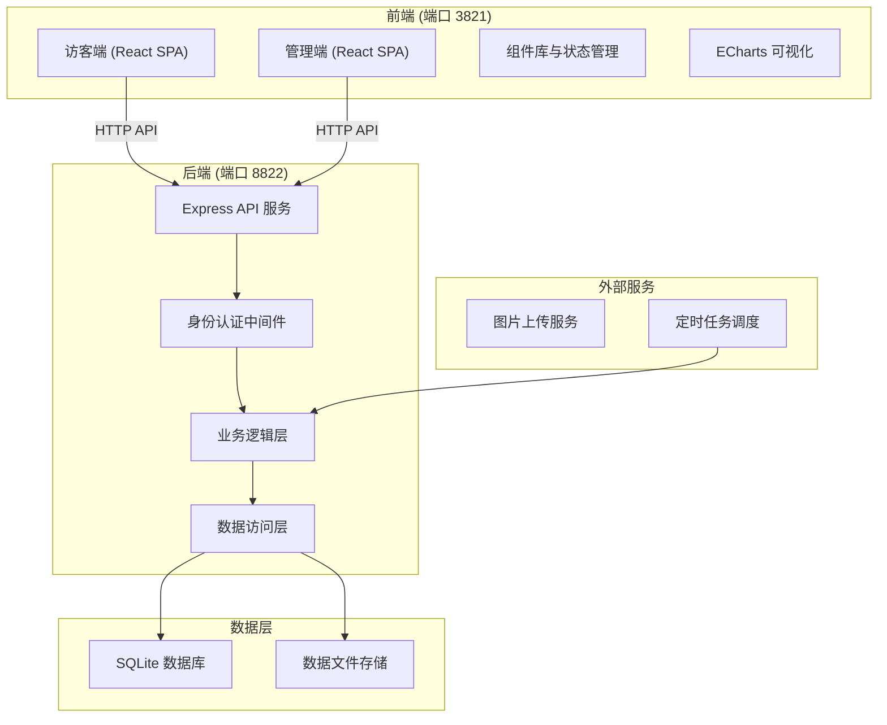
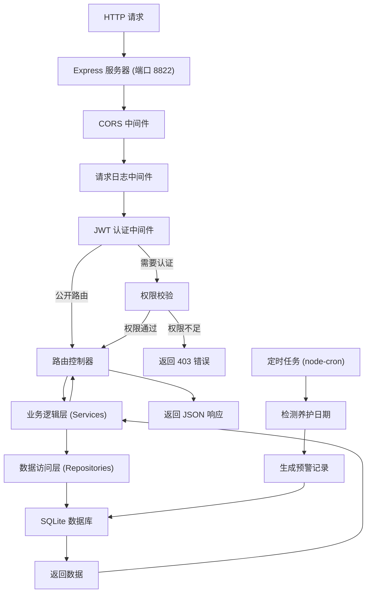
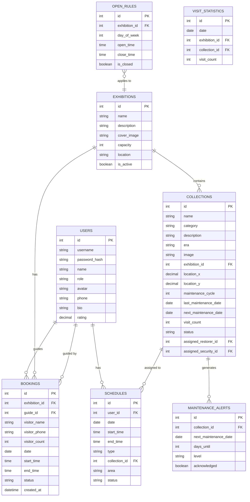

## 1. 架构设计



## 2. 技术描述

### 2.1 技术栈选型
- **前端框架**：React@18 + TypeScript
- **构建工具**：Vite@5
- **样式方案**：TailwindCSS@3
- **状态管理**：Zustand
- **路由管理**：React Router@6
- **UI 组件**：Lucide React（图标）
- **可视化**：ECharts@5
- **后端框架**：Express@4 + TypeScript
- **数据库**：SQLite3（本地文件数据库，无需额外安装）
- **ORM**：better-sqlite3
- **身份认证**：JWT (jsonwebtoken)
- **文件上传**：Multer
- **日期处理**：Day.js

### 2.2 端口分配
- 后端 API 服务：8822 端口
- 前端开发服务：3821 端口

## 3. 路由定义

### 3.1 前端路由

| 路由路径 | 页面名称 | 权限 | 说明 |
|---------|---------|------|------|
| `/` | 访客首页 | 公开 | 展厅展示、热门藏品 |
| `/booking` | 展厅预约 | 公开 | 选择展厅、时段、讲解人员 |
| `/booking/confirm` | 预约确认 | 公开 | 确认预约信息并提交 |
| `/booking/success` | 预约成功 | 公开 | 展示预约成功信息 |
| `/login` | 登录页 | 公开 | 管理员/员工登录 |
| `/dashboard` | 管理大屏 | 管理员 | 藏品分布、养护状态、实时数据 |
| `/collection` | 藏品管理 | 管理员 | 藏品列表、登记、编辑 |
| `/collection/add` | 藏品登记 | 管理员 | 新增藏品表单 |
| `/schedule` | 排班管理 | 管理员 | 人员排班、任务分配 |
| `/statistics` | 统计分析 | 管理员 | 参观频次、展厅利用率 |
| `/settings` | 系统设置 | 管理员 | 开放规则、账号管理 |
| `/tasks` | 我的任务 | 修复师/安保 | 查看养护/排班任务 |

### 3.2 API 路由

| 方法 | 路径 | 模块 | 说明 | 权限 |
|------|------|------|------|------|
| POST | `/api/auth/login` | 认证 | 用户登录 | 公开 |
| GET | `/api/exhibitions` | 展厅 | 获取展厅列表 | 公开 |
| GET | `/api/exhibitions/:id` | 展厅 | 获取展厅详情 | 公开 |
| GET | `/api/exhibitions/:id/timeslots` | 展厅 | 获取展厅可预约时段 | 公开 |
| GET | `/api/guides` | 讲解 | 获取讲解人员列表 | 公开 |
| GET | `/api/guides/:id/timeslots` | 讲解 | 获取讲解人员可预约时段 | 公开 |
| POST | `/api/bookings/check` | 预约 | 检测时段冲突 | 公开 |
| POST | `/api/bookings` | 预约 | 提交预约 | 公开 |
| GET | `/api/bookings` | 预约 | 获取预约列表 | 管理员 |
| GET | `/api/collections` | 藏品 | 获取藏品列表 | 管理员 |
| GET | `/api/collections/:id` | 藏品 | 获取藏品详情 | 管理员 |
| POST | `/api/collections` | 藏品 | 新增藏品 | 管理员 |
| PUT | `/api/collections/:id` | 藏品 | 更新藏品信息 | 管理员 |
| DELETE | `/api/collections/:id` | 藏品 | 删除藏品 | 管理员 |
| GET | `/api/collections/maintenance-alerts` | 藏品 | 获取养护预警列表 | 管理员 |
| GET | `/api/schedules` | 排班 | 获取排班列表 | 管理员 |
| POST | `/api/schedules` | 排班 | 创建排班 | 管理员 |
| PUT | `/api/schedules/:id` | 排班 | 更新排班 | 管理员 |
| POST | `/api/schedules/assign` | 排班 | 分配人员到藏品/区域 | 管理员 |
| GET | `/api/statistics/visit-freq` | 统计 | 获取参观频次数据 | 管理员 |
| GET | `/api/statistics/exhibition-usage` | 统计 | 获取展厅利用率 | 管理员 |
| GET | `/api/statistics/workload` | 统计 | 获取人员工作量 | 管理员 |
| GET | `/api/settings/rules` | 设置 | 获取开放规则 | 管理员 |
| PUT | `/api/settings/rules` | 设置 | 更新开放规则 | 管理员 |
| GET | `/api/users` | 用户 | 获取用户列表 | 管理员 |
| POST | `/api/users` | 用户 | 新增用户 | 管理员 |
| PUT | `/api/users/:id` | 用户 | 更新用户 | 管理员 |
| GET | `/api/tasks/my` | 任务 | 获取我的任务 | 修复师/安保 |
| PUT | `/api/tasks/:id/complete` | 任务 | 完成任务 | 修复师/安保 |

## 4. API 定义

### 4.1 TypeScript 类型定义

```typescript
// 共享类型定义
interface User {
  id: number;
  username: string;
  name: string;
  role: 'admin' | 'restorer' | 'security' | 'guide';
  avatar?: string;
  phone?: string;
  bio?: string;
  rating?: number;
}

interface Exhibition {
  id: number;
  name: string;
  description: string;
  coverImage: string;
  capacity: number;
  location: string;
  featuredCollections: number[];
  isActive: boolean;
}

interface CollectionItem {
  id: number;
  name: string;
  category: string;
  description: string;
  era: string;
  image: string;
  exhibitionId: number;
  locationX: number;
  locationY: number;
  maintenanceCycle: number;
  lastMaintenanceDate: string;
  nextMaintenanceDate: string;
  visitCount: number;
  status: 'normal' | 'maintenance' | 'repair';
  assignedRestorerId?: number;
  assignedSecurityId?: number;
}

interface TimeSlot {
  id: string;
  date: string;
  startTime: string;
  endTime: string;
  isAvailable: boolean;
}

interface Booking {
  id: number;
  exhibitionId: number;
  guideId?: number;
  visitorName: string;
  visitorPhone: string;
  visitorCount: number;
  date: string;
  startTime: string;
  endTime: string;
  status: 'pending' | 'confirmed' | 'cancelled';
  createdAt: string;
}

interface Schedule {
  id: number;
  userId: number;
  date: string;
  startTime: string;
  endTime: string;
  type: 'restoration' | 'security';
  collectionId?: number;
  area?: string;
  status: 'scheduled' | 'in-progress' | 'completed';
}

interface MaintenanceAlert {
  id: number;
  collectionId: number;
  collectionName: string;
  nextMaintenanceDate: string;
  daysUntil: number;
  level: 'warning' | 'urgent' | 'overdue';
}

interface VisitFrequencyData {
  date: string;
  count: number;
  exhibitionId: number;
  exhibitionName: string;
}

interface OpenRule {
  id: number;
  dayOfWeek: number;
  openTime: string;
  closeTime: string;
  isClosed: boolean;
  timeSlots: string[];
}

interface ApiResponse<T> {
  success: boolean;
  data?: T;
  message?: string;
  error?: string;
}
```

## 5. 服务器架构图



## 6. 数据模型

### 6.1 ER 图



### 6.2 DDL 语句

```sql
-- 用户表
CREATE TABLE users (
  id INTEGER PRIMARY KEY AUTOINCREMENT,
  username VARCHAR(50) UNIQUE NOT NULL,
  password_hash VARCHAR(255) NOT NULL,
  name VARCHAR(100) NOT NULL,
  role VARCHAR(20) NOT NULL CHECK (role IN ('admin', 'restorer', 'security', 'guide')),
  avatar VARCHAR(255),
  phone VARCHAR(20),
  bio TEXT,
  rating DECIMAL(2,1) DEFAULT 5.0,
  created_at DATETIME DEFAULT CURRENT_TIMESTAMP
);

-- 展厅表
CREATE TABLE exhibitions (
  id INTEGER PRIMARY KEY AUTOINCREMENT,
  name VARCHAR(100) NOT NULL,
  description TEXT,
  cover_image VARCHAR(255),
  capacity INTEGER DEFAULT 10,
  location VARCHAR(100),
  is_active BOOLEAN DEFAULT 1,
  created_at DATETIME DEFAULT CURRENT_TIMESTAMP
);

-- 藏品表
CREATE TABLE collections (
  id INTEGER PRIMARY KEY AUTOINCREMENT,
  name VARCHAR(100) NOT NULL,
  category VARCHAR(50),
  description TEXT,
  era VARCHAR(50),
  image VARCHAR(255),
  exhibition_id INTEGER REFERENCES exhibitions(id),
  location_x DECIMAL(5,2),
  location_y DECIMAL(5,2),
  maintenance_cycle INTEGER DEFAULT 30,
  last_maintenance_date DATE,
  next_maintenance_date DATE,
  visit_count INTEGER DEFAULT 0,
  status VARCHAR(20) DEFAULT 'normal' CHECK (status IN ('normal', 'maintenance', 'repair')),
  assigned_restorer_id INTEGER REFERENCES users(id),
  assigned_security_id INTEGER REFERENCES users(id),
  created_at DATETIME DEFAULT CURRENT_TIMESTAMP
);

-- 预约表
CREATE TABLE bookings (
  id INTEGER PRIMARY KEY AUTOINCREMENT,
  exhibition_id INTEGER REFERENCES exhibitions(id),
  guide_id INTEGER REFERENCES users(id),
  visitor_name VARCHAR(100) NOT NULL,
  visitor_phone VARCHAR(20) NOT NULL,
  visitor_count INTEGER DEFAULT 1,
  date DATE NOT NULL,
  start_time TIME NOT NULL,
  end_time TIME NOT NULL,
  status VARCHAR(20) DEFAULT 'confirmed' CHECK (status IN ('pending', 'confirmed', 'cancelled')),
  created_at DATETIME DEFAULT CURRENT_TIMESTAMP
);

-- 排班表
CREATE TABLE schedules (
  id INTEGER PRIMARY KEY AUTOINCREMENT,
  user_id INTEGER REFERENCES users(id),
  date DATE NOT NULL,
  start_time TIME NOT NULL,
  end_time TIME NOT NULL,
  type VARCHAR(20) NOT NULL CHECK (type IN ('restoration', 'security')),
  collection_id INTEGER REFERENCES collections(id),
  area VARCHAR(100),
  status VARCHAR(20) DEFAULT 'scheduled' CHECK (status IN ('scheduled', 'in-progress', 'completed')),
  created_at DATETIME DEFAULT CURRENT_TIMESTAMP
);

-- 养护预警表
CREATE TABLE maintenance_alerts (
  id INTEGER PRIMARY KEY AUTOINCREMENT,
  collection_id INTEGER REFERENCES collections(id),
  next_maintenance_date DATE NOT NULL,
  days_until INTEGER NOT NULL,
  level VARCHAR(20) NOT NULL CHECK (level IN ('warning', 'urgent', 'overdue')),
  acknowledged BOOLEAN DEFAULT 0,
  created_at DATETIME DEFAULT CURRENT_TIMESTAMP
);

-- 开放规则表
CREATE TABLE open_rules (
  id INTEGER PRIMARY KEY AUTOINCREMENT,
  exhibition_id INTEGER REFERENCES exhibitions(id),
  day_of_week INTEGER NOT NULL CHECK (day_of_week BETWEEN 0 AND 6),
  open_time TIME NOT NULL,
  close_time TIME NOT NULL,
  is_closed BOOLEAN DEFAULT 0,
  created_at DATETIME DEFAULT CURRENT_TIMESTAMP
);

-- 参观统计表
CREATE TABLE visit_statistics (
  id INTEGER PRIMARY KEY AUTOINCREMENT,
  date DATE NOT NULL,
  exhibition_id INTEGER REFERENCES exhibitions(id),
  collection_id INTEGER REFERENCES collections(id),
  visit_count INTEGER DEFAULT 0,
  created_at DATETIME DEFAULT CURRENT_TIMESTAMP
);

-- 索引
CREATE INDEX idx_bookings_exhibition_date ON bookings(exhibition_id, date);
CREATE INDEX idx_bookings_guide_date ON bookings(guide_id, date);
CREATE INDEX idx_collections_exhibition ON collections(exhibition_id);
CREATE INDEX idx_collections_next_maintenance ON collections(next_maintenance_date);
CREATE INDEX idx_schedules_user_date ON schedules(user_id, date);
CREATE INDEX idx_schedules_collection ON schedules(collection_id);
CREATE INDEX idx_visit_stats_date ON visit_statistics(date);
```

### 6.3 初始数据

```sql
-- 默认管理员账号 (密码: admin123)
INSERT INTO users (username, password_hash, name, role, phone) 
VALUES ('admin', '$2b$10$N9qo8uLOickgx2ZMRZoMyeIjZAgcfl7p92ldGxad68LJZdL17lhWy', '系统管理员', 'admin', '13800000000');

-- 默认修复师
INSERT INTO users (username, password_hash, name, role, phone, bio, rating) 
VALUES ('restorer1', '$2b$10$N9qo8uLOickgx2ZMRZoMyeIjZAgcfl7p92ldGxad68LJZdL17lhWy', '张修复', 'restorer', '13800000001', '从事文物修复工作15年，擅长青铜器、书画修复', 4.9),
       ('restorer2', '$2b$10$N9qo8uLOickgx2ZMRZoMyeIjZAgcfl7p92ldGxad68LJZdL17lhWy', '李修复', 'restorer', '13800000002', '陶瓷、玉石修复专家', 4.8);

-- 默认安保人员
INSERT INTO users (username, password_hash, name, role, phone, bio) 
VALUES ('security1', '$2b$10$N9qo8uLOickgx2ZMRZoMyeIjZAgcfl7p92ldGxad68LJZdL17lhWy', '王安保', 'security', '13800000003', '退伍军人，安保经验丰富'),
       ('security2', '$2b$10$N9qo8uLOickgx2ZMRZoMyeIjZAgcfl7p92ldGxad68LJZdL17lhWy', '赵安保', 'security', '13800000004', '博物馆安保工作10年');

-- 默认讲解人员
INSERT INTO users (username, password_hash, name, role, phone, bio, rating) 
VALUES ('guide1', '$2b$10$N9qo8uLOickgx2ZMRZoMyeIjZAgcfl7p92ldGxad68LJZdL17lhWy', '陈讲解', 'guide', '13800000005', '历史专业硕士，擅长古代艺术讲解', 4.9),
       ('guide2', '$2b$10$N9qo8uLOickgx2ZMRZoMyeIjZAgcfl7p92ldGxad68LJZdL17lhWy', '刘讲解', 'guide', '13800000006', '考古专业，熟悉各朝代历史', 4.8),
       ('guide3', '$2b$10$N9qo8uLOickgx2ZMRZoMyeIjZAgcfl7p92ldGxad68LJZdL17lhWy', '周讲解', 'guide', '13800000007', '艺术史专业，书画鉴赏专家', 4.7);

-- 示例展厅
INSERT INTO exhibitions (name, description, cover_image, capacity, location, is_active) 
VALUES 
('珍宝馆', '收藏历代皇家珍宝，包括金银器、玉器、珠宝等稀世珍品', '/images/exhibition1.jpg', 8, '1楼东侧'),
('书画馆', '展示唐宋元明清各代名家书画真迹', '/images/exhibition2.jpg', 6, '2楼西侧'),
('陶瓷馆', '从新石器时代到明清的陶瓷精品，展示中国陶瓷发展史', '/images/exhibition3.jpg', 10, '1楼西侧'),
('青铜器馆', '商周秦汉青铜器精品，展现青铜时代的辉煌', '/images/exhibition4.jpg', 8, '2楼东侧');

-- 示例藏品
INSERT INTO collections (name, category, description, era, image, exhibition_id, location_x, location_y, maintenance_cycle, last_maintenance_date, next_maintenance_date, visit_count, status) 
VALUES 
('金镶玉九龙璧', '玉器', '清代皇家玉器，采用金镶玉工艺，九条蟠龙栩栩如生', '清代', '/images/col1.jpg', 1, 20.5, 35.2, 30, '2026-05-20', '2026-06-19', 1256, 'normal'),
('清明上河图(局部)', '书画', '宋代张择端名作，描绘汴京繁华景象', '宋代', '/images/col2.jpg', 2, 45.3, 50.1, 15, '2026-06-01', '2026-06-16', 3420, 'normal'),
('汝窑天青釉洗', '陶瓷', '宋代汝窑珍品，天青色釉，开片细腻', '宋代', '/images/col3.jpg', 3, 30.0, 40.5, 60, '2026-04-01', '2026-05-31', 2180, 'normal'),
('司母戊鼎', '青铜器', '商代晚期青铜重器，是目前已知最大的青铜器', '商代', '/images/col4.jpg', 4, 50.0, 50.0, 90, '2026-03-01', '2026-05-30', 2890, 'normal'),
('翠玉白菜', '玉器', '清代宫廷玉雕精品，菜叶鲜活如生', '清代', '/images/col5.jpg', 1, 60.5, 30.0, 30, '2026-05-25', '2026-06-24', 1987, 'normal'),
('兰亭序摹本', '书画', '王羲之兰亭序唐代冯承素摹本', '唐代', '/images/col6.jpg', 2, 20.0, 60.0, 15, '2026-06-05', '2026-06-20', 3120, 'normal'),
('青花瓷瓶', '陶瓷', '明代永乐年间青花瓷，造型优美，纹饰精细', '明代', '/images/col7.jpg', 3, 70.0, 45.0, 45, '2026-05-01', '2026-06-15', 1654, 'normal'),
('四羊方尊', '青铜器', '商代青铜礼器，四角各有一只卷角羊', '商代', '/images/col8.jpg', 4, 25.0, 25.0, 90, '2026-03-15', '2026-06-13', 2345, 'normal');

-- 默认开放规则
INSERT INTO open_rules (exhibition_id, day_of_week, open_time, close_time, is_closed)
SELECT e.id, d.day, '09:00', '17:00', CASE WHEN d.day = 1 THEN 1 ELSE 0 END
FROM exhibitions e
CROSS JOIN (SELECT 0 as day UNION SELECT 1 UNION SELECT 2 UNION SELECT 3 UNION SELECT 4 UNION SELECT 5 UNION SELECT 6) d;

-- 示例预约数据
INSERT INTO bookings (exhibition_id, guide_id, visitor_name, visitor_phone, visitor_count, date, start_time, end_time, status)
VALUES 
(1, 1, '张三', '13900000001', 4, '2026-06-20', '10:00', '11:30', 'confirmed'),
(2, 2, '李四', '13900000002', 2, '2026-06-20', '14:00', '15:30', 'confirmed'),
(3, 3, '王五', '13900000003', 6, '2026-06-21', '09:30', '11:00', 'confirmed');

-- 示例参观统计
INSERT INTO visit_statistics (date, exhibition_id, collection_id, visit_count)
VALUES 
('2026-06-16', 1, 1, 45),
('2026-06-16', 1, 5, 38),
('2026-06-16', 2, 2, 78),
('2026-06-16', 2, 6, 65),
('2026-06-16', 3, 3, 56),
('2026-06-16', 3, 7, 42),
('2026-06-16', 4, 4, 67),
('2026-06-16', 4, 8, 54);
```
