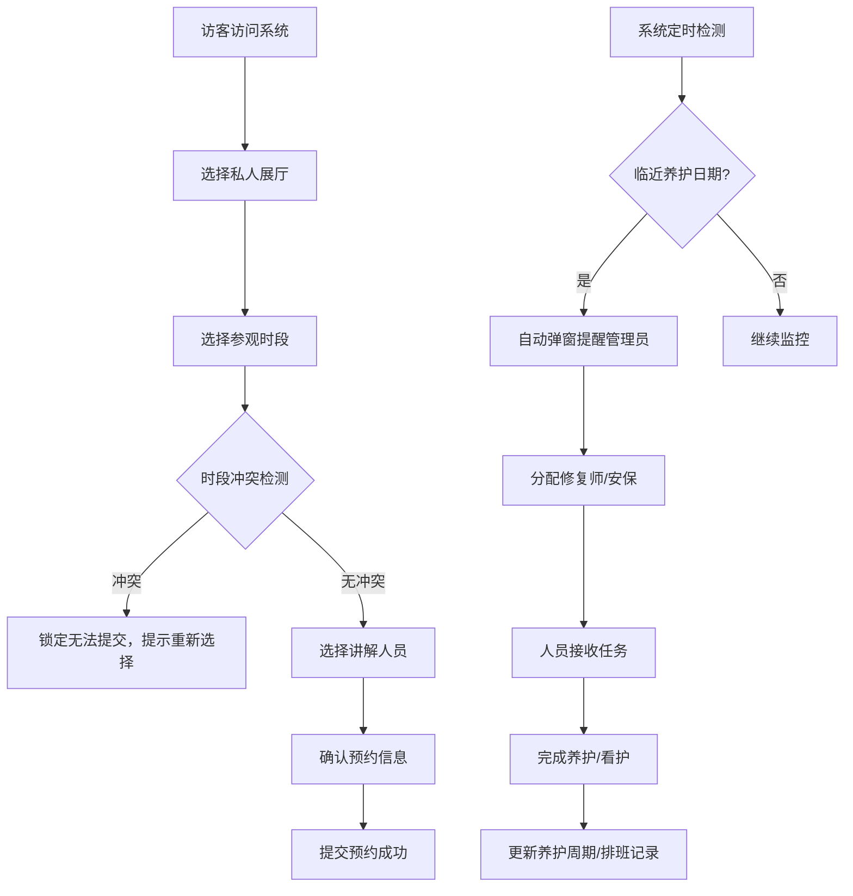

## 1. 产品概述

博物馆藏品管理与访客预约系统，实现藏品全生命周期管理、私人展厅预约、人员智能排班的一体化平台。面向访客提供便捷的私人参观预约服务，面向管理员提供可视化大屏管控、养护提醒、人员调度等核心功能。

## 2. 核心功能

### 2.1 用户角色

| 角色 | 登录方式 | 核心权限 |
|------|---------|----------|
| 访客 | 无需登录 | 浏览展厅信息、预约私人展厅、选择讲解人员、查看预约记录 |
| 管理员 | 账号密码登录 | 藏品登记管理、养护周期配置、大屏监控、人员排班、开放规则调整、参观统计 |
| 修复师 | 账号密码登录 | 查看养护任务、提交养护记录 |
| 安保人员 | 账号密码登录 | 查看排班任务、签到打卡 |

### 2.2 功能模块

1. **访客端首页**：展厅展示、热门藏品推荐、快速预约入口
2. **展厅预约页面**：私人展厅列表、时段选择、讲解人员选择、预约确认
3. **管理大屏首页**：藏品分布热力图、养护状态概览、实时预约数据
4. **藏品管理页面**：藏品登记、信息编辑、存放位置管理、养护周期配置
5. **排班管理页面**：修复师排班、安保人员排班、任务分配
6. **统计分析页面**：参观频次统计、展厅利用率、人员工作量统计
7. **系统设置页面**：展厅开放规则配置、时段管理、账号管理

### 2.3 页面详情

| 页面名称 | 模块名称 | 功能描述 |
|---------|---------|----------|
| 访客首页 | 展厅展示 | 轮播展示各私人展厅特色、藏品预览、预约按钮 |
| 访客首页 | 热门藏品 | 展示高关注度藏品卡片，点击查看详情 |
| 访客首页 | 快速预约 | 一步预约入口，选择日期时段 |
| 展厅预约 | 展厅列表 | 卡片式展示各私人展厅信息、容纳人数、特色藏品 |
| 展厅预约 | 时段选择 | 日历+时间段网格，已预约时段灰色禁用，冲突锁定 |
| 展厅预约 | 讲解人员 | 展示讲解人员头像、简介、评分、可预约时段 |
| 展厅预约 | 预约确认 | 展示预约详情、费用信息、提交预约 |
| 管理大屏 | 藏品分布图 | 2D平面图展示藏品存放位置，点击查看详情 |
| 管理大屏 | 养护状态 | 卡片展示各藏品养护周期，临近日期高亮预警 |
| 管理大屏 | 实时数据 | 今日预约、在馆人数、安保在岗情况 |
| 管理大屏 | 弹窗提醒 | 临近养护、异常情况自动弹窗 |
| 藏品管理 | 藏品登记 | 表单录入藏品信息、上传图片、设置养护周期 |
| 藏品管理 | 列表展示 | 表格展示所有藏品，支持筛选、搜索 |
| 排班管理 | 日历视图 | 月/周视图展示排班情况，拖拽调整 |
| 排班管理 | 人员分配 | 为特定藏品/区域分配修复师和安保人员 |
| 统计分析 | 参观频次 | 柱状图/折线图展示各展厅/藏品参观数据 |
| 统计分析 | 开放规则 | 可视化配置展厅开放时段、节假日调整 |

## 3. 核心流程

### 3.1 访客预约流程
访客进入首页 → 选择私人展厅 → 选择参观日期和时段（系统检测冲突）→ 选择专属讲解人员 → 确认预约信息 → 提交预约（冲突则锁定无法提交）→ 预约成功

### 3.2 养护提醒流程
系统定时检测养护日期 → 临近3天自动弹窗提醒 → 管理员分配修复师 → 修复师接收任务 → 完成养护提交记录 → 系统更新下次养护日期

### 3.3 流程图

## 4. 用户界面设计

### 4.1 设计风格
- **主色调**：深墨绿 (#1A3A3A) - 代表博物馆的厚重与文化底蕴
- **辅助色**：鎏金色 (#C9A962) - 代表珍贵与典雅
- **点缀色**：朱砂红 (#B4433C) - 用于预警和重要提醒
- **中性色**：米白 (#F5F1E8)、深灰 (#2C2C2C)、浅灰 (#E8E4DB)
- **按钮风格**：圆角矩形，鎏金色边框，悬停有微光效果
- **字体**：标题使用「思源宋体」体现文化感，正文使用「思源黑体」保证可读性
- **布局风格**：
  - 访客端：卡片式布局，优雅留白，大量图文结合
  - 管理端：数据大屏风格，深色背景，信息密度高，可视化图表丰富
- **图标**：线性图标，鎏金色填充，统一24px尺寸

### 4.2 页面设计概览

| 页面名称 | 模块名称 | UI 元素 |
|---------|---------|---------|
| 访客首页 | Hero区域 | 全屏轮播图，渐变遮罩，鎏金色大标题，预约按钮动效 |
| 访客首页 | 展厅卡片 | 悬停上浮，底部鎏金线条装饰，图片暗角处理 |
| 展厅预约 | 时段网格 | 可选时段白色背景，已预约灰色禁用，选中鎏金色高亮 |
| 展厅预约 | 讲解人员卡片 | 圆形头像，评分星星，悬浮显示简介 |
| 管理大屏 | 藏品分布图 | 深色背景，热区高亮，悬停显示藏品信息浮窗 |
| 管理大屏 | 养护预警卡片 | 临近日期朱砂红边框，脉冲动画提醒 |
| 管理大屏 | 弹窗提醒 | 居中显示，模糊背景，确认/分配按钮 |
| 藏品管理 | 登记表单 | 分区布局，图片拖拽上传，实时预览 |
| 统计分析 | 图表区域 | ECharts 深色主题，鎏金色数据线，交互动效 |

### 4.3 响应式设计
- 采用桌面优先设计，适配 1920×1080 管理大屏
- 访客端适配平板和移动端，断点 768px 和 480px
- 触控区域最小 44×44px，按钮间距 16px 以上
- 移动端时段选择改为垂直滚动列表

### 4.4 动效设计
- 页面加载：元素渐入，错峰 100ms 出现
- 卡片悬停：上浮 4px，阴影加深，鎏金色边框发光
- 弹窗出现：背景模糊渐变，弹窗从下方滑入
- 预警脉冲：红色边框每2秒呼吸一次
- 数据更新：数字滚动动画，图表重绘过渡
